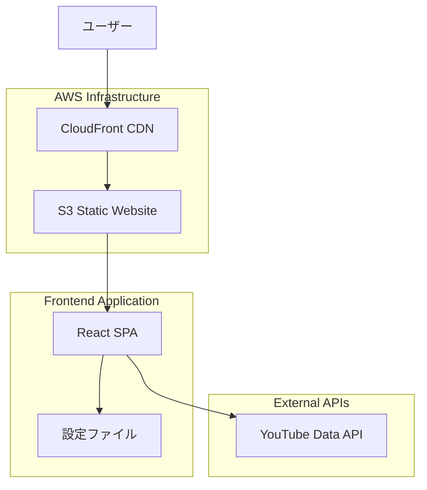
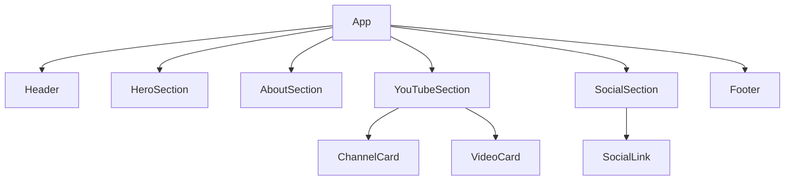
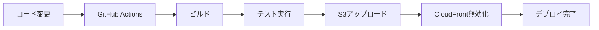

# デザイン設計書

## 概要

個人ポータルサイトは、React + TypeScript + Vite を使用したシングルページアプリケーション（SPA）として開発します。モダンなフロントエンド技術スタックを採用し、YouTube Data API との連携により動的コンテンツを提供し、AWS S3 + CloudFront での静的サイトホスティングにより高いパフォーマンスと可用性を実現します。

## UI/UX デザイン

### 完成画面イメージ

```
┌─────────────────────────────────────────────────────────────┐
│                        ヘッダー                              │
│  ロゴ/名前                                    ナビゲーション │
└─────────────────────────────────────────────────────────────┘

┌─────────────────────────────────────────────────────────────┐
│                      ヒーローセクション                        │
│                                                             │
│        ┌─────────┐                                         │
│        │         │    こんにちは！                          │
│        │ アバター │    [開発者名] です                       │
│        │  画像   │                                         │
│        └─────────┘    [職業・肩書き]                        │
│                                                             │
│                      [簡潔な自己紹介]                        │
│                                                             │
└─────────────────────────────────────────────────────────────┘

┌─────────────────────────────────────────────────────────────┐
│                      自己紹介セクション                        │
│                                                             │
│  私について                                                  │
│  ────────                                                   │
│                                                             │
│  [詳細な自己紹介文章]                                        │
│  [スキルセット・経歴情報]                                     │
│                                                             │
└─────────────────────────────────────────────────────────────┘

┌─────────────────────────────────────────────────────────────┐
│                    YouTubeチャンネル                         │
│                                                             │
│  YouTubeチャンネル                                           │
│  ──────────────                                             │
│                                                             │
│  ┌─────────────────────┐    ┌─────────────────────┐        │
│  │   チャンネル1       │    │   チャンネル2       │        │
│  │                     │    │                     │        │
│  │ ┌─────────────────┐ │    │ ┌─────────────────┐ │        │
│  │ │   最新動画      │ │    │ │   最新動画      │ │        │
│  │ │   サムネイル    │ │    │ │   サムネイル    │ │        │
│  │ └─────────────────┘ │    │ └─────────────────┘ │        │
│  │                     │    │                     │        │
│  │ 動画タイトル        │    │ 動画タイトル        │        │
│  │ 投稿日              │    │ 投稿日              │        │
│  │                     │    │                     │        │
│  │ [チャンネル説明]    │    │ [チャンネル説明]    │        │
│  │                     │    │                     │        │
│  │ [チャンネルを見る]  │    │ [チャンネルを見る]  │        │
│  └─────────────────────┘    └─────────────────────┘        │
└─────────────────────────────────────────────────────────────┘

┌─────────────────────────────────────────────────────────────┐
│                    ソーシャルメディア                         │
│                                                             │
│  つながりましょう                                            │
│  ──────────────                                             │
│                                                             │
│     ┌─────────┐                                            │
│     │ Twitter │  @username                                 │
│     │  アイコン │  フォローする                              │
│     └─────────┘                                            │
│                                                             │
│  [将来的に他のSNSリンクも追加可能]                           │
│                                                             │
└─────────────────────────────────────────────────────────────┘

┌─────────────────────────────────────────────────────────────┐
│                        フッター                              │
│                                                             │
│              © 2024 [開発者名]. All rights reserved.       │
│                                                             │
└─────────────────────────────────────────────────────────────┘
```

### レスポンシブデザイン

#### デスクトップ表示 (1200px 以上)

- 2 カラムレイアウトで YouTube チャンネルを横並び表示
- 大きなヒーローセクションで印象的な第一印象
- 適切な余白とタイポグラフィ

#### タブレット表示 (768px - 1199px)

- 1 カラムレイアウトに変更
- YouTube チャンネルは縦積み表示
- タッチフレンドリーなボタンサイズ

#### モバイル表示 (767px 以下)

- コンパクトなヒーローセクション
- スタック形式のレイアウト
- 読みやすいフォントサイズ調整

### カラーパレット（実装版から更新）

```
プライマリカラー:   #00B33A (ディープグリーン)
セカンダリカラー:   #4B5563 (ニュートラルグレー)
アクセントカラー:   #FF7700 (鮮やかオレンジ)
背景色:            #FFFFFF (ホワイト)
テキストカラー:     #1F2937 (ダークグレー)
境界線カラー:       #E5E7EB (ライトグレー)
プライマリ透明:     rgba(0, 179, 58, 0.2) (20%透明度)
```

### タイポグラフィ（実装版から更新）

```
フォントファミリー:  Inter (Google Fonts)
見出し1 (H1):      text-5xl~7xl (48px~72px), font-weight: 800-900
見出し2 (H2):      text-4xl (36px), font-weight: 800
見出し3 (H3):      text-2xl (24px), font-weight: 700
サブタイトル:       text-3xl (30px), font-weight: 800
本文:              text-lg (18px), font-weight: 400
小文字:            text-base (16px), font-weight: 400
キャプション:       text-sm (14px), font-weight: 400
```

### アニメーション効果（実装版から更新）

- **ページ読み込み時**: ヒーローセクションのフェードインアニメーション（1 秒）
- **スクロール時**: Intersection Observer API を使用した要素の段階的表示
- **ホバー効果**:
  - カードの微細なスケールアップ（scale-[1.03]）
  - シャドウの強化（shadow-2xl → shadow-3xl）
  - 色の変化（透明度 20% → 100%）
- **動画カード**: ホバー時のスケールアップ効果（scale-105）
- **トランジション**: duration-150 ～ 500 の滑らかなアニメーション

### 実装された UI 要素

#### ヘッダー

- スティッキーヘッダー（sticky top-0）
- ロゴ + .dev サフィックス
- レスポンシブナビゲーション
- CTA ボタン（お問い合わせ）

#### ヒーローセクション

- 大きなアバター画像（192x192px）
- オンライン状態インジケーター
- アニメーション付きの挨拶（animate-bounce）
- レスポンシブレイアウト（flex-col md:flex-row）

#### 自己紹介セクション

- セクション区切り線（h-1.5 w-24 bg-primary）
- スキルタグ（丸角、ホバー効果付き）
- カードデザイン（rounded-3xl shadow-xl）

#### YouTube セクション

- 2 カラムグリッドレイアウト
- 動画サムネイル with プレイボタンオーバーレイ
- Lucide アイコン使用
- ホバー時のスケール効果

#### ソーシャルセクション

- 拡張可能なリンクカード
- アイコン + テキスト + アクセントアイコン
- 統一されたカードデザイン

#### フッター

- 丸角デザイン（rounded-t-[3rem]）
- グラデーション背景
- ハートアイコン付きコピーライト

### 技術実装詳細

#### CSS フレームワーク

- Tailwind CSS（CDN 版）
- カスタム CSS 変数でカラーパレット管理

#### アイコンライブラリ

- Lucide Icons（軽量、カスタマイズ可能）

#### JavaScript 機能

- Intersection Observer API（スクロールアニメーション）
- 遅延アイコン初期化
- レスポンシブ対応

## アーキテクチャ

### システム構成図



### 技術スタック

**フロントエンド**

- React 18 - UI ライブラリ
- TypeScript - 型安全な開発
- Vite - 高速ビルドツール
- Tailwind CSS - ユーティリティファースト CSS
- React Query - API データ管理
- Framer Motion - アニメーション

**外部 API**

- YouTube Data API v3 - 動画情報取得

**インフラストラクチャ**

- AWS S3 - 静的ファイルホスティング
- AWS CloudFront - CDN 配信
- AWS Route 53 - DNS 管理（オプション）

## コンポーネントとインターフェース

### コンポーネント階層



### 主要コンポーネント

#### 1. App コンポーネント

- 全体のレイアウト管理
- グローバル状態管理
- エラーバウンダリ

#### 2. HeroSection コンポーネント

- ファーストビューの表示
- 自己紹介の概要
- アニメーション効果

#### 3. AboutSection コンポーネント

- 詳細な自己紹介
- スキルセット表示
- 経歴情報

#### 4. YouTubeSection コンポーネント

- チャンネル情報表示
- 最新動画の取得・表示
- YouTube Data API 連携

#### 5. SocialSection コンポーネント

- ソーシャルメディアリンク
- 拡張可能な構造

### インターフェース定義

```typescript
// 基本的な型定義
interface PersonalInfo {
  name: string;
  title: string;
  description: string;
  avatar: string;
}

interface YouTubeChannel {
  id: string;
  name: string;
  description: string;
  url: string;
  customUrl?: string;
}

interface YouTubeVideo {
  id: string;
  title: string;
  description: string;
  thumbnail: string;
  publishedAt: string;
  url: string;
}

interface SocialLink {
  platform: string;
  url: string;
  icon: string;
  label: string;
}

interface SiteConfig {
  personalInfo: PersonalInfo;
  youtubeChannels: YouTubeChannel[];
  socialLinks: SocialLink[];
  theme: ThemeConfig;
}
```

## データモデル

### 設定ファイル構造

```json
{
  "personalInfo": {
    "name": "開発者名",
    "title": "職業・肩書き",
    "description": "自己紹介文",
    "avatar": "/images/avatar.jpg"
  },
  "youtubeChannels": [
    {
      "id": "UCxxxxxxxxxxxxx",
      "name": "チャンネル名1",
      "description": "チャンネル説明1",
      "url": "https://youtube.com/channel/UCxxxxxxxxxxxxx"
    },
    {
      "id": "UCyyyyyyyyyyy",
      "name": "チャンネル名2",
      "description": "チャンネル説明2",
      "url": "https://youtube.com/channel/UCyyyyyyyyyyy"
    }
  ],
  "socialLinks": [
    {
      "platform": "twitter",
      "url": "https://twitter.com/username",
      "icon": "twitter",
      "label": "Twitter"
    }
  ],
  "theme": {
    "primaryColor": "#3B82F6",
    "secondaryColor": "#1F2937",
    "accentColor": "#F59E0B"
  }
}
```

### YouTube API レスポンス処理

YouTube Data API v3 からの動画情報を以下の形式で処理：

```typescript
interface YouTubeAPIResponse {
  items: Array<{
    id: { videoId: string };
    snippet: {
      title: string;
      description: string;
      publishedAt: string;
      thumbnails: {
        medium: { url: string };
        high: { url: string };
      };
    };
  }>;
}
```

## エラーハンドリング

### エラー種別と対応

1. **YouTube API エラー**

   - API 制限超過: フォールバック表示
   - ネットワークエラー: リトライ機能
   - 認証エラー: エラーメッセージ表示

2. **設定ファイルエラー**

   - ファイル読み込み失敗: デフォルト値使用
   - JSON 解析エラー: エラー境界での処理

3. **レンダリングエラー**
   - コンポーネントエラー: エラーバウンダリ
   - 画像読み込み失敗: プレースホルダー表示

### エラーバウンダリ実装

```typescript
interface ErrorBoundaryState {
  hasError: boolean;
  error?: Error;
}

class ErrorBoundary extends Component<PropsWithChildren, ErrorBoundaryState> {
  // エラー捕捉とフォールバックUI表示
}
```

## テスト戦略

### テスト階層

1. **単体テスト (Jest + React Testing Library)**

   - コンポーネントの個別機能テスト
   - ユーティリティ関数のテスト
   - カスタムフックのテスト

2. **統合テスト**

   - YouTube API 連携テスト
   - 設定ファイル読み込みテスト
   - ルーティングテスト

3. **E2E テスト (Playwright)**
   - ユーザーフロー全体のテスト
   - レスポンシブデザインテスト
   - パフォーマンステスト

### テスト環境

- **開発環境**: Jest + React Testing Library
- **CI/CD**: GitHub Actions
- **モック**: YouTube API のモック実装
- **カバレッジ**: 80%以上を目標

## パフォーマンス最適化

### フロントエンド最適化

1. **コード分割**

   - React.lazy による動的インポート
   - ルートベースの分割

2. **画像最適化**

   - WebP 形式の使用
   - 遅延読み込み実装
   - レスポンシブ画像

3. **キャッシュ戦略**
   - React Query による API キャッシュ
   - Service Worker 実装（オプション）

### インフラ最適化

1. **CloudFront 設定**

   - 適切なキャッシュヘッダー
   - Gzip 圧縮有効化
   - HTTP/2 サポート

2. **S3 設定**
   - 静的ウェブサイトホスティング
   - 適切な MIME タイプ設定

## セキュリティ考慮事項

### フロントエンド セキュリティ

1. **API キー管理**

   - 環境変数での管理
   - リファラー制限設定

2. **XSS 対策**

   - React の自動エスケープ活用
   - dangerouslySetInnerHTML の使用制限

3. **HTTPS 強制**
   - CloudFront での HTTPS リダイレクト
   - HSTS ヘッダー設定

### AWS セキュリティ

1. **S3 バケット設定**

   - パブリック読み取り専用
   - 不要な権限の制限

2. **CloudFront 設定**
   - WAF 統合（オプション）
   - 地理的制限（必要に応じて）

## デプロイメント戦略

### CI/CD パイプライン



### 環境構成

1. **開発環境**

   - ローカル開発サーバー
   - ホットリロード
   - 開発用 API 設定

2. **本番環境**
   - AWS S3 + CloudFront
   - 本番用 API 設定
   - 監視・ログ設定

## 拡張性設計

### 新機能追加のための設計

1. **設定駆動アーキテクチャ**

   - JSON 設定ファイルでのコンテンツ管理
   - プラグイン式コンポーネント構造

2. **API 統合フレームワーク**

   - 統一された API 呼び出しインターフェース
   - 新しいソーシャルメディア対応

3. **テーマシステム**
   - CSS 変数によるテーマ切り替え
   - ダークモード対応準備

### 将来的な機能拡張例

- ブログ記事表示
- GitHub リポジトリ連携
- お問い合わせフォーム
- 多言語対応
- PWA 対応
